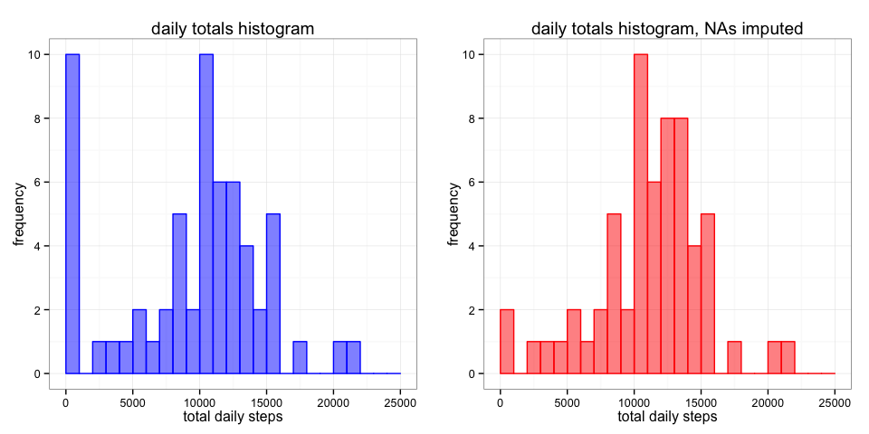

# Reproducible Research: Peer Assessment 1

## Loading and preprocessing the data

First lets load up my favorite libraries for this job, and read the data. Im going to convert the date immediately from a character string to date. Its good practice to do investigate some summaries of the data to avoid suprises, so lets do that too.


```r
library("dplyr"); library("ggplot2"); library("lattice"); library(gridExtra)
library(xtable)

dataset <- read.csv(file = 'activity.csv',
                 header = TRUE,
                 stringsAsFactors = FALSE)

dataset$date <- as.Date(dataset$date)

# quick peek at dataset
head(dataset)
```

```
##   steps       date interval
## 1    NA 2012-10-01        0
## 2    NA 2012-10-01        5
## 3    NA 2012-10-01       10
## 4    NA 2012-10-01       15
## 5    NA 2012-10-01       20
## 6    NA 2012-10-01       25
```

```r
summary(dataset)
```

```
##      steps             date               interval     
##  Min.   :  0.00   Min.   :2012-10-01   Min.   :   0.0  
##  1st Qu.:  0.00   1st Qu.:2012-10-16   1st Qu.: 588.8  
##  Median :  0.00   Median :2012-10-31   Median :1177.5  
##  Mean   : 37.38   Mean   :2012-10-31   Mean   :1177.5  
##  3rd Qu.: 12.00   3rd Qu.:2012-11-15   3rd Qu.:1766.2  
##  Max.   :806.00   Max.   :2012-11-30   Max.   :2355.0  
##  NA's   :2304
```

## What is mean total number of steps taken per day?

This is fairly straightforward. Lets use dplyr, as it is the best tool for the job. Firstly a histogram for the total steps per day:


```r
# first get total steps by grouping by day, and taking care when
# summarising to remove NA's
total_steps <- dataset %>%
  group_by(date) %>%
  summarise(total = sum(steps, na.rm = T))

plot1 <- ggplot(total_steps, aes(total, na.rm = T)) +
  geom_histogram(color = 'blue', fill = 'blue', alpha = 0.5) +
  xlab('total daily steps') +
  ylab('frequency') +
  ggtitle('daily totals histogram') +
  scale_y_continuous(breaks=c(0, 2, 4, 6, 8, 10)) +
  theme_bw()

plot1
```

 

Im also going to create a little function to calculate the mean and median total number of steps taken per day. This will hopefully come in handy later as well!


```r
# make a summary function for mean and median.
# I am careful to ensure that na.rm is true!
MeanMedian <- function(x){
  funs <- c(mean, median)
  vapply(funs, function(f) f(x, na.rm = T), numeric(1))
}

# we see below the mean and median number of steps taken per day
MeanMedian(total_steps$total)
```

```
## [1]  9354.23 10395.00
```

As a comment, it seems odd that 10 days have approx 0 - 500 steps. Perhaps the device was not being worn? Further investigation would be required here if this was a 'real' study.

## What is the average daily activity pattern?

Once again, I will use dplyr as it is well suited for this job.

```r
# group by interval this time
daily_activity <- dataset %>%
  group_by(interval) %>%
  summarise(average = mean(steps, na.rm = T))

# quick peek at data
daily_activity
```

```
## Source: local data frame [288 x 2]
## 
##    interval   average
## 1         0 1.7169811
## 2         5 0.3396226
## 3        10 0.1320755
## 4        15 0.1509434
## 5        20 0.0754717
## 6        25 2.0943396
## 7        30 0.5283019
## 8        35 0.8679245
## 9        40 0.0000000
## 10       45 1.4716981
## ..      ...       ...
```

The lattice xyplot() can be used to knock up a quick time series plot. We can also subset to find the max average daily activity. summary() could have been alternativly.


```r
xyplot(average ~ interval,
       data = daily_activity,
       type = c("l"),
       ylab = "mean steps")
```

 

```r
# subset to find the max average daily activity
daily_activity[daily_activity$average == max(daily_activity$average), ]
```

```
## Source: local data frame [1 x 2]
## 
##   interval  average
## 1      835 206.1698
```

## Imputing missing values

Time for a bit of fun...


```r
# firstly determine number of missing values.
# note from summary taken initially we know they are all in 
# steps column
sum(is.na(dataset))
```

```
## [1] 2304
```

```r
# to impute, find mean and sd for each interval
# then draw from a (absolute, as negative steps doesnt make sense)
# random normal distribution for missing samples

# first group by interval, and determine the mean and sd for each interval
intervalMeanSd <- dataset %>%
  group_by(interval) %>%
  summarise(intMean = mean(steps, na.rm = T),
            intSd = sd(steps, na.rm = T))

# merge with the origional dataset so have the mean and sd columns
intervalMeanSd <- merge(dataset, intervalMeanSd, by = 'interval', all = F)

# determine the row numbers of missing values
naIndex <- which(is.na(intervalMeanSd$steps))

# set seed for reproduceability, and impute
set.seed(100)
intervalMeanSd$steps[naIndex] <- abs(rnorm(1,
                                        mean = intervalMeanSd$intMean[naIndex],
                                        sd = intervalMeanSd$intSd[naIndex]))

# finally, select only columns of interest, and
# confirm no missing values
imputeData <- select(intervalMeanSd, steps, date, interval)
sum(is.na(imputeData))
```

```
## [1] 0
```

Now we can repeat the steps above with our newly imputed version of the data. It would be nice to compare the two sets as well (one with NA's removed, one with imputation)


```r
total_steps2 <- imputeData %>%
  group_by(date) %>%
  summarise(total = sum(steps))

plot2 <- ggplot(total_steps2, aes(total, na.rm = T)) +
  geom_histogram(color = 'red', fill = 'red', alpha = 0.5) +
  xlab('total daily steps') +
  ylab('frequency') +
  ggtitle('daily totals histogram, NAs imputed') +
  scale_y_continuous(breaks=c(0, 2, 4, 6, 8, 10)) +
  theme_bw()

grid.arrange(plot1, plot2, ncol = 2)
```

 

```r
# lets have a look at the mean and median, and also compare
# to the origional data
rbind(MeanMedian(total_steps2$total), MeanMedian(total_steps$total))
```

```
##          [,1]  [,2]
## [1,] 9440.683 10395
## [2,] 9354.230 10395
```

Its hard to see any difference in the histograms due to the bin widths, but we see that the mean is now slightly shifted. The imputation strategy has not effected the median.

## Are there differences in activity patterns between weekdays and weekends?

For this, weekdays() and a dplyr chain with a bit of mutating does the trick. A lattice xyplot() seems suitable for making a quick, neat plot.


```r
dayData <- imputeData %>%
  mutate(weekday = weekdays(date)) %>%
  mutate(isWeekend = factor(weekday == 'Saturday' | weekday == 'Sunday',
                            labels = c('Weekday','Weekend'))) %>%
  group_by(isWeekend, interval) %>%
  summarise(mean = mean(steps))

xyplot( mean ~ interval | as.factor(isWeekend),
       data = dayData,
       type = c("l"),
       layout = c(1, 2),
       ylab = "mean steps")
```

 
